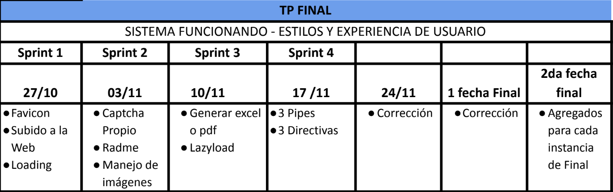
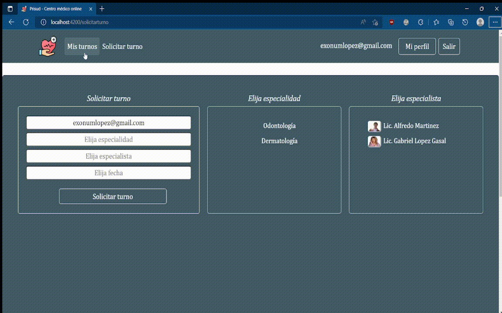
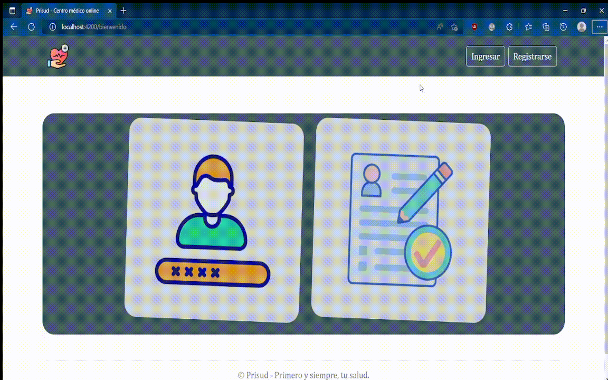

<h1> PARCIAL 2 - LABO IV </h1>

***
<h3 id="indice">Índice</h3>
1) <a href="#objetivo">Objetivo</a> <br>
2) <a href="#requerimientosExcluyentes">Requerimientos excluyentes</a> <br>
3) <a href="#requerimientosPorFecha">Requerimientos por fecha</a> <br>
4) <a href="#profesores">Profesores</a> <br>
5) <a href="#alumno">Alumno</a> <br>
6) <a href="#manualDeUso">Manual de uso</a> <br>

***
<h3 id="alumno">Alumno</h3>
<a href="https://github.com/ex0num">Gabriel Lopez Gasal</a><br>

***
<h3 id="comandos">Comandos utilizados</h3>

<label>Creación del proyecto</label>
```
$ ng new Prisud
```

<label>Buildeo y deploy del proyecto</label>
```
$ ng build
$ firebase deploy --only hosting
```

<label>Generación de componentes</label>
```
$ ng g c Vistas/login
```
 
<label>Generación de modulos</label>
```
$ ng g module modulo-turnos</label>
```

<label>Generación de guardianes</label>
```
$ ng g guard Guardianes/onlyAdmin
```

<label>Generación de servicios</label>
```
$ ng g service Servicios/auth
```

<label>Implementación de Firebase</label>
```
$ npm install firebase
$ npm install -g firebase-tools
$ firebase init
``` 

***
<h3 id="profesores">Profesores</h3>

<a>Franco Lippi</a> - <strong>Profesor</strong> <br>
<a>Ezequiel Oggioni</a> - <strong>Profesor</strong> <br>
  
***
<h3 id="objetivo">Objetivo</h3>
Debemos realizar un sistema según las necesidades y deseos del cliente, para eso tenemos una breve
descripción de lo que el cliente nos comenta acerca de su negocio.
“La clínica OnLine, especialista en salud, cuenta actualmente con consultorios (6 en la actualidad),
dos laboratorios (físicos en la clínica), y una sala de espera general. Está abierta al público de lunes a
viernes en el horario de 8:00 a 19:00, y los sábados en el horario de 8:00 a 14:00.

Trabajan en ella profesionales de diversas especialidades, que ocupan los consultorios acorde a su
disponibilidad, y reciben en ellos pacientes con turno para consulta o tratamiento. Dichos turnos son
pedidos por la web seleccionando el profesional o la especialidad. La duración mínima de un turno es
30 minutos.” pero los profesionales pueden cambiar la duración según su especialidad. Estos
profesionales pueden tener más de una especialidad.
También contamos con un sector dentro de la clínica que se encarga de la organización y
administración de la misma.<br>

***
<h3 id="requerimientosExcluyentes">Requerimientos excluyentes</h3>


***
<h3 id="requerimientosPorFecha">Requerimientos por fechas de entrega</h3>

<strong>
  Requerimientos 1er sprint:
</strong> 

<br>
En esta entrega debemos tener la posibilidad de registrarse, ingresar al sistema y administrar los
usuarios que van a poder utilizar nuestra plataforma. A continuación se detallan algunas
especificaciones:<br>
● Página de bienvenida<br>
○ Tiene que tener los accesos al login y registro del sistema<br>
● Registro<br>
○ Desde esta sección vamos a poder registrar Pacientes y Especialistas.<br>
○ Para los pacientes los datos serán<br>
■ Nombre<br>
■ Apellido<br>
■ Edad<br>
■ DNI<br>
■ Obra Social<br>
■ Mail<br>
■ Password<br>
■ 2 imágenes para su perfil.<br>
○ Para los Especialistas<br>
■ Nombre<br>
■ Apellido<br>
■ Edad<br>
■ DNI<br>
■ Especialidad<br>
● En este caso se le deberá dar la posibilidad de elegir o agregar alguna
que no se encuentre entre las posibilidades<br>
■ Mail<br>
■ Password<br>
■ Imagen de perfil<br>
○ Debemos validar los campos según corresponda<br>
● Login<br>
○ Desde esta sección vamos a ingresar al sistema.<br>

○ Debe contar con los botones de acceso rápido<br>
○ Los usuarios con perfil Especialista solo pueden ingresar si un usuario administrador
aprobó su cuenta y verificó el mail al momento de registrarse.<br>
○ Los usuarios con perfil Paciente solo pueden ingresar si verificaron su mail al
momento de registrarse.<br>

● Sección Usuarios<br>
○ Esta sección solamente la va a poder ver el usuario con perfil Administrador<br>
○ Además de ver la información de los usuarios, desde esta sección se deberá habilitar<br>
o inhabilitar el acceso al sistema de los usuarios Especialista.<br>
○ También se podrá generar nuevos usuarios, con el mismo requerimiento que en la
sección registro. Pero desde esta sección se podrá generar un usuario Administrador.<br>
○ Para los usuarios Administrador<br>
■ Nombre<br>
■ Apellido<br>
■ Edad<br>
■ DNI<br>
■ Mail<br>
■ Password<br>
■ imágen para su perfil.<br>

<strong>
  Requerimientos 2do sprint:
</strong>

<br>
En esta entrega nos vamos a encargar de la carga y visualización de turnos. Debemos incorporar las
siguientes secciones:<br>
● Mis Turnos<br>
○ Como PACIENTE<br>
■ Solo tendrá acceso el Paciente y le mostrará los turnos que él solicitó.<br>
■ Esta sección deberá contar con un filtro único donde podrá filtrar por:<br>
● Especialidad<br>
● Especialista<br>
● NO UTILIZAR Combobox<br>
■ A su vez desde este listado podrá realizar las siguientes acciones:<br>
● Cancelar turno<br>
○ Solamente debe ser visible si el turno no fue realizado.<br>
○ Debe dejar un comentario del porque se cancela el turno.<br>
● Ver reseña.<br>
○ Solo debe ser visible si el turno tiene un comentario o reseña
cargado.<br>
● Completar encuesta.<br>
○ Solamente debe estar visible si el especialista marcó el turno
como realizado y dejo la reseña.<br>
● Calificar Atención<br>
○ Solamente debe ser visible una vez que el turno sea
realizado.<br>
○ El paciente debe dejar un comentario de como fue la
atención del Especialista.<br>
■ Debe estar bien visible el estado del turno.<br>
■ Solamente mostrar la acción que puede realizar el usuario.<br>
<br>
○ Como ESPECIALISTA<br>
■ Solo tendrá acceso el Especialista y le mostrará los turnos que tiene
asignados.<br>
■ Esta sección deberá contar con un filtro único donde podrá filtrar por:<br>
● Especialidad<br>
● Paciente<br>
● NO UTILIZAR Combobox<br>
■ A su vez desde este listado podrá realizar las siguientes acciones:<br>
● Cancelar turno<br>
○ Solamente debe ser visible si el turno no fue Aceptado,
Realizado o Rechazado.<br>
○ Para cancelar el turno se debe dejar un comentario del
porque se cancela el mismo.<br>
● Rechazar turno<br>
○ Solamente debe ser visible si el turno no fue Aceptado,
Realizado o Cancelado.<br>
○ Para rechazar el turno se debe dejar un comentario del
porque se rechaza el mismo.<br>
● Aceptar turno<br>
○ Solamente debe ser visible si el turno no fue Realizado,
Cancelado o Rechazado.<br>
<br>
● Finalizar Turno<br>
○ Solamente debe ser visible si el turno fue Aceptado.<br>
○ Para finalizar el turno se debe dejar una reseña o comentario
de la consulta y diagnóstico realizado.<br>
● Ver Reseña<br>
○ Solo debe ser visible si el turno tiene un comentario o reseña
cargado.<br>
■ Debe estar bien visible el estado del turno.<br>
■ Solamente mostrar la acción que puede realizar el usuario.<br>
● Turnos<br>
○ Solo tendrá acceso el Administrador y le mostrará los turnos de la clínica.<br>
○ Esta sección deberá contar con un filtro único donde podrá filtrar por:<br>
■ Especialidad<br>
■ Especialista<br>
■ NO UTILIZAR Combobox<br>
○ A su vez desde este listado podrá realizar las siguientes acciones:<br>
■ Cancelar turno<br>
● Solamente debe ser visible si el turno no fue Aceptado, Realizado o
Rechazado.<br>
● Para cancelar el turno se debe dejar un comentario del porque se
cancela el mismo.<br>
<br>
● Solicitar Turno<br>
○ En esta sección tendrán acceso tanto el Paciente como el Administrador y permitirá
realizar la carga de un turno.
○ Se deberá seleccionar:
■ Especialidad
■ Especialista
■ Día y horario del turno.
● El paciente debe tener la posibilidad de elegir turno dentro de los
próximos 15 días.
● Estas fechas tienen que estar relacionadas al especialista
seleccionado y su disponibilidad horaria.
● NO UTILIZAR Datepicker
■ En el caso del administrador, deberá marcar el Paciente.

● Mi perfil
○ Debe contar con los datos del usuario. Nombre, Apellido, Imágenes, etc.
○ Mis horarios
■ Solamente los usuario con perfil Especialista
■ En esta sección el Especialista deberá marcar su disponibilidad horaria. Tener
en cuenta que el Especialista puede tener más de una especialidad asociada.

Además debemos incorporar los requerimientos mínimos.
El captcha, puede ser el de google o uno propio, debemos incorporarlo en el registro de los usuarios.
El Readme debe contener una explicación de la Clínica, pantallas, formas de acceder a las diferentes
secciones y que contiene cada sección.

***
<h3 id="manualDeUso">Manual de uso</h3>

<strong>¿Cómo solicito un turno?</strong>


<strong>¿Cómo cancelo un turno?</strong>


<strong>¿Cómo inicio sesión?</strong>


